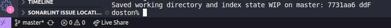
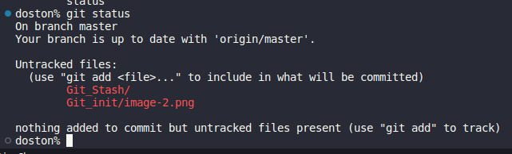
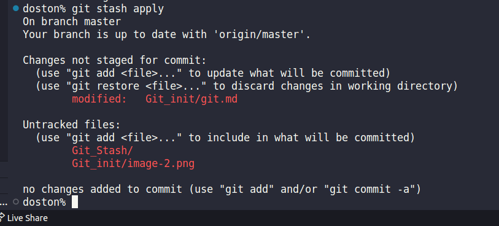
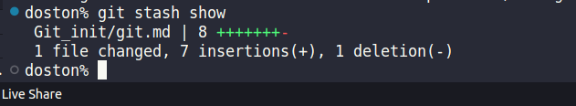

## git stash
```
Buyruq sizning ishchi nusxangizga kiritilgan o'zgarishlarni keyinroq qo'llashingiz uchun git stashvaqtincha "ro'yxatdan o'tish" (yoki chetga surib qo'yish ) imkonini beradi. Agar siz kontekstni o'zgartirishingiz kerak bo'lsa va hali amalga oshirishga tayyor bo'lmasangiz, o'zgarishlarni keyinga qoldirish foydali bo'ladi.
```
**~$ git stash**


**~$ git status**

```
Oldindan kutilayotgan o'zgarishlarni qo'llash uchun quyidagi buyruqdan foydalaning git stash pop
```


```
Bundan tashqari, o'zgarishlarni ishchi nusxangizga ularni orqadan olib tashlamasdan ham qo'llashingiz mumkin. Buning uchun buyruqdan foydalaning git stash apply:
```

**~$ git stash apply**

```
Agar bir xil kutilayotgan o'zgarishlarni bir nechta filiallarga qo'llash kerak bo'lsa, bu foydali bo'ladi.
```



**~$  git stash list**
```
biz localniyga saqlangan  malumotlar listni  chiqaradi
```

**$ git stash pop stash@{2}**
```
Kechiktirilgan o'zgarishlar to'plamlari orasidagi farqlarni ko'rish
git stash showKutilayotgan o'zgarishlar to'plamining xulosasini ko'rish uchun buyruqni bajaring :
```


# Kechiktirilgan o'zgarishlar to'plamlari orasidagi farqlarni ko'rish
```
git stash showKutilayotgan o'zgarishlar to'plamining xulosasini ko'rish uchun buyruqni bajaring :
```
**~$ git stash show**




# O'zgarishlarni qisman kechiktirish
```
Siz bitta faylni, bir nechta faylni yoki fayllarga individual o'zgartirishlarni kechiktirishni tanlashingiz mumkin. Agar siz buyruqqa git stashparametrni (yoki ) o'tkazsangiz, u ish nusxasidagi har bir o'zgartirilgan kod bo'lagi uchun bajariladi va kechiktirishni tasdiqlashni so'raydi:-p--patch
```


