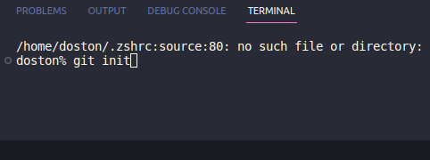
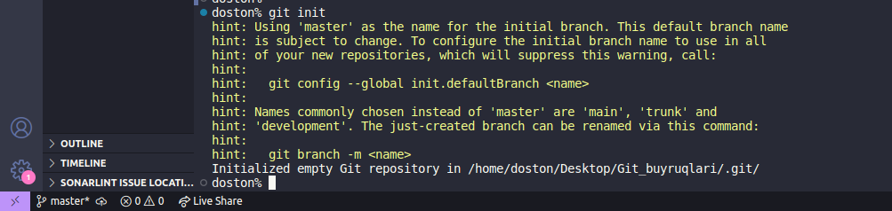
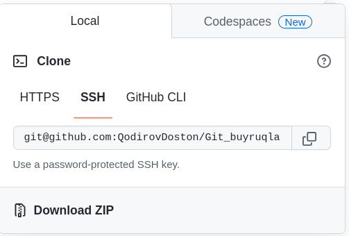

#  Git-Init Command in Git | Explained

```
 Git-Init buyruqi Git repozitoriyasini boshlash uchun ishlatiladi. Bu, yangi repozitoriya yaratishda va mavjud repozitoriyaga yangi boshqaruvchi ishlab chiqishda kerak bo'ladi.
 ```
```
Git-Init buyruqini ishlatish uchun terminal (komandlar chanchi) oching va repozitoriyani boshlashni istalgan joyda bajarish uchun kerakli katalogga o'ting.
```
 Keyin quyidagi buyruqni ishlatish mumkin: git init.






# Git Init: A Step-by-Step Guide
```
Nima uchun kerak:  yangi Git repozitoriyasini qanday yaratish kerakligini o'rgatadi.
```
**git init**
```
 git init. Ushbu buyruqning asosiy funktsiyalari va qo'shimcha funktsiyalari haqida bilib olasiz . Quyidagi ma'lumotlar taqdim etiladi:

```
```
buyruq git initva uning imkoniyatlaridan foydalanish;
katalogning umumiy ko'rinishi;
```
```
katalog uchun moslashtirilgan muhit o'zgaruvchisi qiymatlari git init;
```
```
taqqoslash git initvagit clone;
```
## bilan toza omborlarni yaratish git init;
```
~$ git init --bare <directory>
```
## Uchun shablonlar git init.


Buyruq git inityangi Git omborini yaratadi. U mavjud bo'lmagan loyihani Git omboriga aylantirish yoki yangi bo'sh omborni ishga tushirish uchun ishlatilishi mumkin. Ko'pgina boshqa Git buyruqlarini omborni ishga tushirmasdan ishlatib bo'lmaydi, shuning uchun bu buyruq odatda yangi loyihada ishga tushadigan birinchi buyruqdir.
```

# Git Clone

```
Git Clone buyruqi mavjud bir Git repozitoriyasini o'z kompyuteringizga nusxa olish uchun ishlatiladi. Bu, boshqa o'rnatmalardagi repozitoriyalarni olish uchun juda oson va samarali usul.
```
```
Qachon ishlatiladi: Git Clone buyruqini ishlatish uchun terminalda quyidagi buyruqni ishlatishingiz kerak: git clone <repoyani URL>. Bu buyruq sizga repozitoriyani olish imkonini beradi.
```

GIT clone

Biz Git bo'yicha xizmatlar taklif qilayotgan dasturlar orqali loyihalarni klonlashtirish (clone) imkoni mavjud. Asosiy ko'rinishi qo'yidagicha.
```


Terminalda ushbu buyruqni yurgazamiz
```
git clone git@github.com:uzbekdevs/loyiha.git
```
 #### bizni localniyga  projectni clon qilib olib keladi holos .